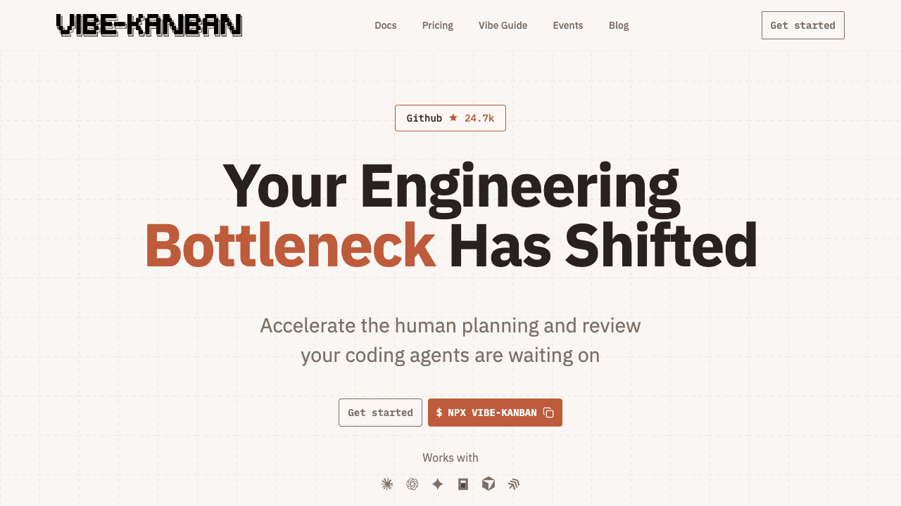
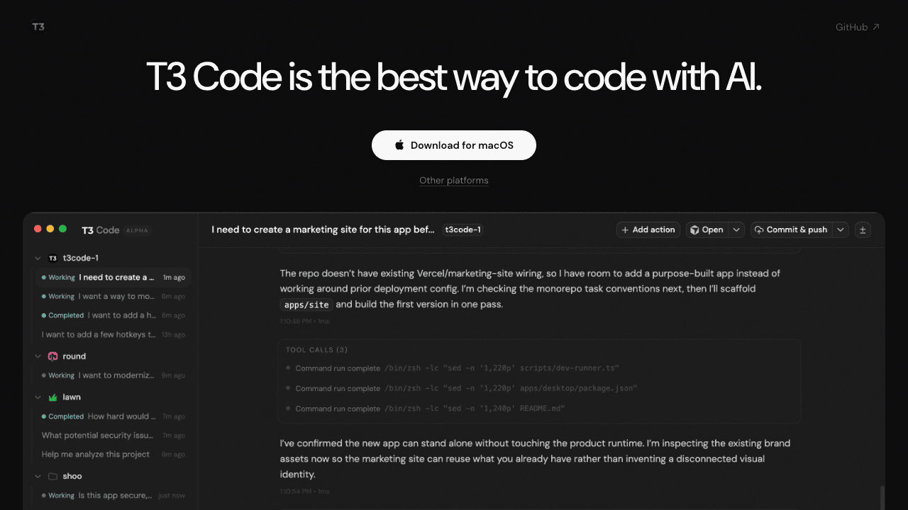
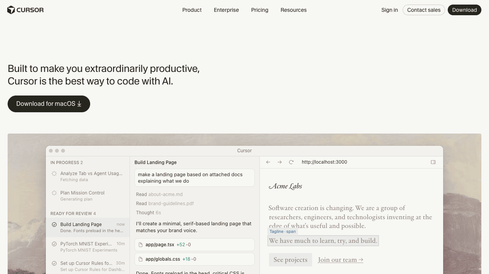
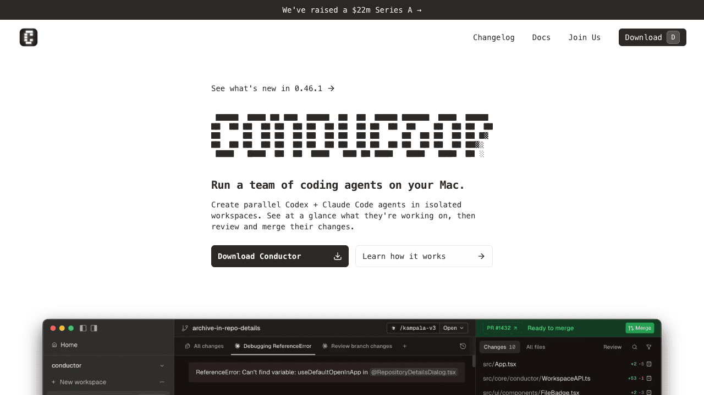
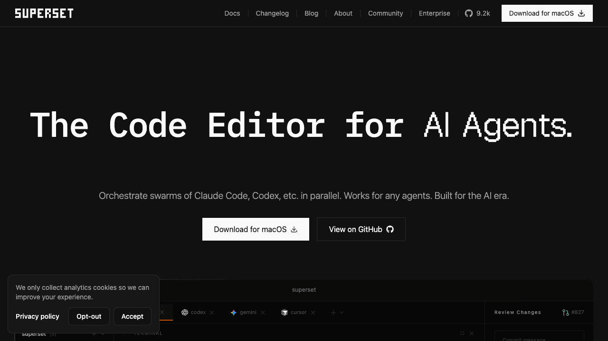
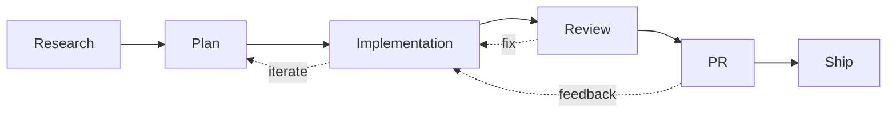
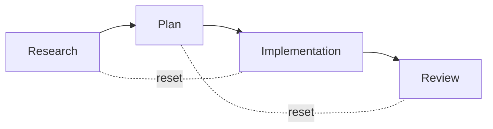

  

    

    ElevenLabs Claude Code Friday's
    

  

  <h1 class="!text-[56px] !leading-[1.1] !font-bold text-white max-w-4xl tracking-tight">
    The future of IDE's in the age of agents
  </h1>
  

    My AI-first coding workflow: the tools, prompts and flows I use to automate the simple parts of engineering work.
  

  

    Agent orchestration
    Parallel threads
    Context engineering
  

<!--
Hey from comment
-->

---
layout: center
class: text-left
---

<h1 class="!text-white !text-4xl !font-bold !tracking-tight">Quick room check</h1>

  

    How many people have multiple versions of the repo they are working in?
  

  

    How many people use worktrees specifically?
  

  

    How many agents do you run in parallel on average?
  

---
layout: image-right
layoutClass: gap-14
image: ./assets/kid.jpg
---

<h1 class="!text-white !text-4xl !font-bold !tracking-tight">Who am I?</h1>

  

    /01
    Wrote my first line of code at 10 or 11 trying to build a Unity game
  

  

    /02
    Founder of many failed or sunset startups and side projects
  

  

    /03
    Before Eleven, I worked as an SDE on software for operating spacecraft
  

  

    /04
    I do a lot of open source work; biggest claim to fame is <code>Zog</code>, a validation library for Go
  

  

    /05
    I work mostly on the marketing website
  

<!--
Say only
- Spacecraft
- Zog
-->

---
layout: image-right
image: ./assets/loot.jpeg
class: bg-top
layoutClass: gap-14
---

<h1 class="!text-white !text-4xl !font-bold !tracking-tight">And also!</h1>

  

    --
    I run my own home server
  

  

    --
    I play Dungeons and Dragons and airsoft
  

  

    --
    I hate breaking flow, so I hate notifications
  

<!--
Say only
- I play dnd & so does my cat
-->

<!-- --- -->
<!-- layout: default -->
<!-- --- -->
<!---->
<!-- <h1 class="!text-white !text-4xl !font-bold !tracking-tight">What I won't discuss today</h1> -->
<!---->
<!-- 
 -->
<!--   
 -->
<!--      -->
<!--     Tools or SOPs for improving agent output -->
<!--   
 -->
<!--   
 -->
<!--      -->
<!--     Context engineering -->
<!--   
 -->
<!--   
 -->
<!--      -->
<!--     Claude Code specific ideas -->
<!--   
 -->
<!--   
 -->
<!--      -->
<!--     Which models are best for what -->
<!--   
 -->
<!--   
 -->
<!--      -->
<!--     Skills, MCPs, subagents... -->
<!--   
 -->
<!-- 
 -->
<!---->
<!-- 
But if people are interested in some of that maybe I can come back at some point to chat about it
 -->

---
layout: center
class: text-center
---

  
Confession

  <h2 class="!text-4xl !font-bold !tracking-tight text-white">Guilty admission</h2>
  

  
I was a coding agent skeptic until ~Dec 2025

<!--
I was using cursor every day, in fact I started in 2023 few months after they launched. 

- But to speed up the work I was doing at the time. very hands on
-->

---
layout: default
class: "!flex !flex-col !overflow-hidden"
---

<h1 class="!text-white !text-3xl !font-bold !tracking-tight !flex-shrink-0">But then something changed</h1>

New Opus & GPT models. So I started using Cursor's background agents. With and without worktrees.

<ImageContainer src="./assets/cursor-2.png" alt="Cursor agent interface" />

<!--

- editing, conflicts bringing agent code into current working branch to make edits
- Forgetting where I had threads open. What stuff is shipped, waiting for reviews, etc. Couldn't keep it all in my head. 
- Losing context of what I was doing inside a thread. What file was I looking at? What file was I editing? etc
-->

---
layout: image
class: text-left
image: ./assets/isolation.png
backgroundSize: contain
---

<h1 class="!text-white !text-3xl !font-bold !tracking-tight">I had this problem every week</h1>

---
layout: center
---

<h1 class="!text-white !text-4xl !font-bold !tracking-tight">4 Cursor instances</h1>

I found myself with 4 Cursor instances open, juggling between them.

<ImageContainer src="./assets/4-cursors.png" alt="Cursor agent interface" />

<!--
- I would often forget in what instance I had what. Would jump around
- PC crashed every day
- Often times I needed a new instance which meant opening a new worktree or project which took like 10s and completely killed my flow
- Ultimately I needed more than 4
-->

---
layout: center
---

  
Exploration

  <h1 class="!text-6xl !font-bold !tracking-tight text-white">Cloud agents</h1>

---
layout: image
image: ./assets/cloud-agents/1st.png
backgroundSize: contain
---

---
layout: image
image: ./assets/cloud-agents/2nd.png
backgroundSize: contain
---

---
layout: center
class: text-center
---

  <h2 class="!text-4xl !font-bold !tracking-tight text-white">What am I doing wrong?</h2>
  

  
Someone has to have figured this out already. Let's research.

---
layout: center
class: text-center
---

  
Research

  <h2 class="!text-5xl !font-bold !tracking-tight text-white">Current solution shapes</h2>

---
zoom: 0.82
---

<h1 class="!text-white !text-3xl !font-bold !tracking-tight">Kanban</h1>

  

    
    

      
Vibe Kanban

    

  

  

    
    

      
Automaker

    

  

---
zoom: 0.76
---

<h1 class="!text-white !text-3xl !font-bold !tracking-tight">Agent first</h1>

  

    
    

      
T3 Code

    

  

  

    
    

      
Cursor 3.0

    

  

  

    
    

      
Conductor

    

  

  

    
    

      
Superset

    

  

---
zoom: 0.82
layout: image
image: https://miro.medium.com/v2/resize:fit:700/1*ReBwrC1sc9USnhvYXcrd4A.jpeg
---

<!-- <h1 class="!text-white">Gastown</h1> -->

<!--
Gastown. Orchestrator first
-->

---
layout: center
---

  
My approach

  <h1 class="!text-6xl !font-bold !tracking-tight text-white">Build your own</h1>

---
layout: center
zoom: 0.82
---

<h1 class="!text-white !text-3xl !font-bold !tracking-tight text-center mb-10">Thinking in threads</h1>

<!--
Now we just have to run this in parallel as much as possible. That means doing as little ourselves as possible and delegating as much as possible to the agent
-->

---
layout: image
image: ./assets/threads-of-work.png
---

<!--
Key idea here which is pretty obvious is that the less user involvement the more threads we can have at once
-->

---
layout: default
layoutClass: gap-10
---

<h1 class="!text-white !text-3xl !font-bold !tracking-tight">Creator of OpenClaw</h1>

<Tweet id="2019903946056237516" scale="0.85" />

<!--
- Is vibe coding
- We cannot go that far yet without disastrous consequences
-->

---
layout: center
class: text-center
---

  <h2 class="!text-4xl !font-bold !tracking-tight text-white">Switched to Neovim ~btw</h2>
  

  
One persistent session per thread of work

<!--
- Wanted one persistent session per thread of work
- Each thread gets its own neovim session that stays alive
- No more juggling multiple IDE windows or forgetting where things are
-->

---
layout: default
---

<h1 class="!text-white !text-4xl !font-bold !tracking-tight">How I work</h1>

  

    01
    

    Throw / kick off
  

  

    02
    

    Work
  

  

    03
    

    Go to what needs me
  

  

    04
    

    Push PRs
  

  

    05
    

    PR merge = session deleted
  

Effectively I'm a pull-based system on what needs me

<!--
- "Throw/kick off" creates a worktree, names the branch, sets up the environment automatically. Show how cursor does it. Worktree reuse is key here — don't create new ones unnecessarily
- "Work" is the agent doing its thing inside the session
- "Go to what needs me" — I poll across sessions, only jumping in where I'm actually needed
- PR merge triggers cleanup — the session and worktree get deleted automatically
- The mental model shift: I'm not pushing work forward, I'm pulling from a queue of things that need my attention
-->

---
layout: default
---

<h1 class="!text-white !text-4xl !font-bold !tracking-tight">Why this works</h1>

  
No need to keep context of what I'm working on

  
Switching threads is instant

  
Everything is isolated — environment auto-setup

  
Hydration!

<!--
- I only have to think about the next thing and poll from the queue. No juggling mental context across threads
- Moving from one thread of work to the next is instant — just switch to the session
- Each worktree is fully isolated. Environment is automatically set up at creation time
- Hydration: when I jump into a session, the agent has already done work and left me context. I hydrate into the thread quickly rather than rebuilding context from scratch
-->

---
layout: center
class: text-center
---

  
Takeaway

  <h2 class="!text-4xl !font-bold !tracking-tight text-white leading-snug">Bottom line</h2>
  

  
The future is probably agent-first apps

  
But I don't want to wait 8s for Cursor to open, so I'm stuck in crazy land

<!--
- Agent-first apps like T3 Code, Conductor, etc. are likely the direction everything is heading
- But the overhead of GUI-heavy tools kills flow — 8 seconds to open Cursor is 8 seconds too many
- So for now, neovim + worktrees + custom orchestration is the sweet spot for me
- "Crazy land" = building your own workflow tooling, but it works
-->

---
layout: center
class: text-center
---

  <h2 class="!text-4xl !font-bold !tracking-tight text-white">But at least I can say</h2>
  
I use nvim btw

---
layout: center
class: text-center
---

  <h1 class="!text-6xl !font-bold !tracking-tight text-white">Questions?</h1>
  

---
layout: center
class: text-center
---

  

  
Looking ahead

  <h2 class="!text-5xl !font-bold !tracking-tight text-white">Into the future</h2>
  
What I'm working on, what I'd like & where I think things are going

  

---
layout: default
zoom: 0.88
---

<h1 class="!text-white !text-4xl !font-bold !tracking-tight">Levels of autonomy</h1>

  

    L0
    No autonomy — each step interrupts you
  

  

    L1
    Implementation — research, plan, implement, commit
  

  

    L2
    PR — previous + open PR
  

  

    L3
    Semi-full — previous + address feedback
  

  

    L4
    Vibe — previous + merge
  

<!--
- At creation time for the thread you define its level of autonomy, which defines your interception points
- L0: no autonomy, you're involved at every step — basically pair programming
- L1: agent does research, planning, implementation, and commits — you review after
- L2: agent also opens the PR for you
- L3: agent also addresses PR feedback from reviewers autonomously
- L4: full vibe mode — agent merges when approved. You trust the process end to end
-->

---
layout: default
---

<h1 class="!text-white !text-4xl !font-bold !tracking-tight"><s class="text-[#555]">Cloud agents</s> Cloud sessions</h1>

Local-like IDE experience

  

    Sessions run remotely, not on your machine
  

  

    Challenge:
    Secrets management
  

  

    Provider model:
    fly.io design
  

<!--
- Cloud sessions let you offload entirely — sessions don't consume local resources
- Biggest challenge is secrets. How do you give a cloud agent access to your credentials, API keys, etc. securely?
- Provider model reference: https://fly.io/blog/design-and-implementation/ — good design for how to think about remote execution environments
-->

---
layout: default
---

<h1 class="!text-white !text-4xl !font-bold !tracking-tight">Reset to step</h1>

Go back to a previous step and iterate from there

<!--
- Implementation is bad? Go back to plan, see what the issue is, iterate from there
- Plan is bad? Go back to research
- This is like git reset but for the agent workflow itself — you rewind the thread to an earlier stage
- Avoids starting from scratch when only one phase went wrong
-->

---
layout: center
class: text-center
---

  <h1 class="!text-5xl !font-bold !tracking-tight text-white">Port isolation</h1>

